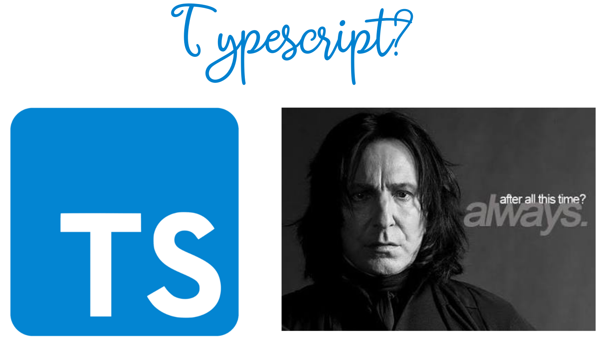

### Hi there 👋, I'm Meera, a full-stack engineer!

I'm a full-stack engineer with a background in theoretical physics. :woman_technologist: 

I'm currently open for work, so if you're hiring feel free to [message me on LinkedIn](https://www.linkedin.com/in/mpatel66/).

### What I've been working on....
#### Remedic :hospital:
Remedic is a full stack app that provides an in-person patient-doctor consultation across a language-barrier without using a translator. Patients can fill out a pre-consultation quesionnaire in one of 24 languages, and communicate with a doctor via a live-translated chat app.

#### Tsundoku :book:
Tsundoku is a front-end native app for searching and saving the books you'd like to read or have read.

#### Honing my TS skills
As well as working on some apps, over the past few weeks, I've been transitioning from primarily writing in Javascript to Typescript. Although writing in TS takes a bit longer, I now think about the shape of the data or spend a bit more time thinking through the logic before I dive head-first into writing the code.

### My Languages and tools

<code></code>
<code></code>
<code></code>
<code></code>
<code></code>
<code></code>
<code></code>

### Things I like to do besides coding
- Reading :books:
- Hiking :walking_woman:
- Star gazing :telescope: :moon:
- Watching youTubers discuss which Star Trek is the best.... (it's obviously DS9 people!!!)

### How I Git

